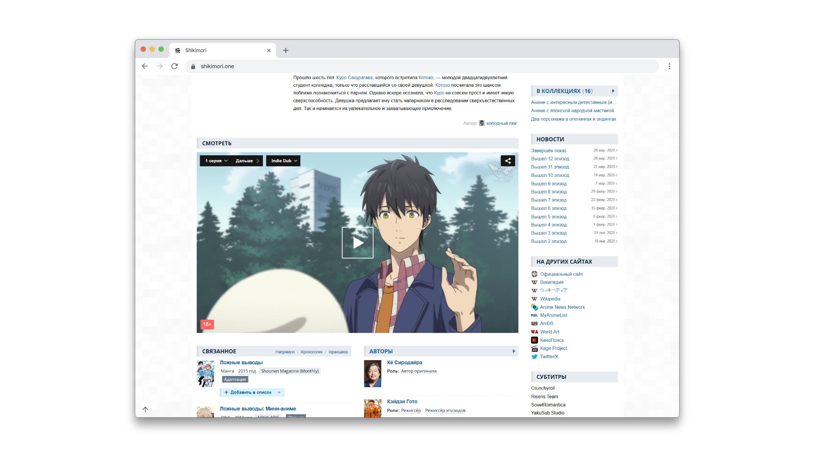

## Shiki Watch

adds the ability to watch on the Shikimori. Please create an issue if you encounter any problems.

Forked from [Malanavi/Watch-and-download-on-Shikimori](https://github.com/Malanavi/Watch-and-download-on-Shikimori).
#### Contributing is encouraged 🤗
